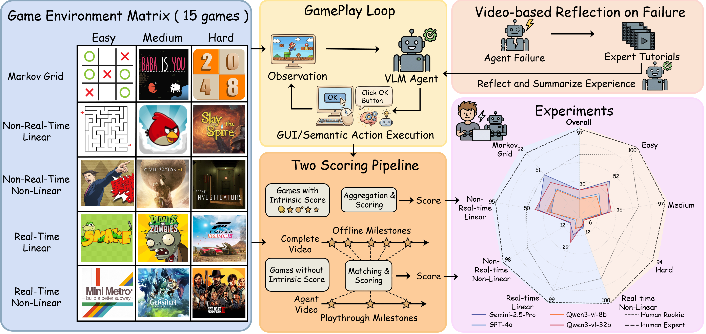

<div align="center">

# GameVerse: Can Vision-Language Models Learn from Video-based Reflection?

*Kuan Zhang<sup>&ast;</sup>, Dongchen Liu<sup>&ast;</sup>, Qiyue Zhao, Jinkun Hou, Xinran Zhang, Qinlei Xie, Miao Liu<sup>&dagger;</sup>, Yiming Li<sup>&dagger;</sup>*

</div>

<p align="center">
  <a href="https://arxiv.org/abs/<YOUR_PAPER_ID>">
    
  </a>
  <a href="https://<YOUR_PROJECT_PAGE_URL>">
    
  </a>
  <a href="LICENSE.txt">
    
  </a>
</p>

<p align="center">
  
</p>

**GameVerse** is a comprehensive benchmark framework designed to evaluate the capabilities of game-playing agents and Vision-Language Models (VLMs) across a diverse set of complex games.

---

## Quick Start

```bash
conda create -n generalgamebench python=3.10 -y
conda activate generalgamebench
pip install -r requirements.txt
```

Create API key files (example for OpenAI):

```bash
mkdir -p src/agent_servers/keys/openai-key
echo "YOUR_OPENAI_KEY" > src/agent_servers/keys/openai-key/key.env
```

Run one evaluation:

```bash
python scripts/play_game.py --config src/agent_client/configs/snake/config.yaml
```

Or use leaderboard launcher scripts (recommended for reproducible batch runs):

```bash
# Linux / macOS
bash scripts/leaderboard/{game}/{game}.sh
```

```powershell
# Windows PowerShell
powershell -ExecutionPolicy Bypass -File scripts/leaderboard/{game}/{game}.ps1
```

## Installation

### 1) Game setup

Please complete game-specific setup first:

- [docs/setup_angry_birds.md](docs/setup_angry_birds.md)
- [docs/setup_baba_is_you.md](docs/setup_baba_is_you.md)
- [docs/setup_civilization.md](docs/setup_civilization.md)
- [docs/setup_forza_horizon5.md](docs/setup_forza_horizon5.md)
- [docs/setup_genshin.md](docs/setup_genshin.md)
- [docs/setup_maze.md](docs/setup_maze.md)
- [docs/setup_metro.md](docs/setup_metro.md)
- [docs/setup_pvz.md](docs/setup_pvz.md)
- [docs/setup_red_dead_redemption2.md](docs/setup_red_dead_redemption2.md)
- [docs/setup_slay_the_spire.md](docs/setup_slay_the_spire.md)
- [docs/setup_snake.md](docs/setup_snake.md)
- [docs/setup_tic_tac_toe.md](docs/setup_tic_tac_toe.md)
- [docs/setup_twenty_fourty_eight.md](docs/setup_twenty_fourty_eight.md)
- [docs/setup_ace_attorney.md](docs/setup_ace_attorney.md)

### 2) Conda environment

From repository root:

```bash
conda create -n generalgamebench python=3.10 -y
conda activate generalgamebench
pip install -r requirements.txt
```

Optional editable install:

```bash
pip install -e .
```

### 3) API key setup

Store key files in `src/agent_servers/keys` (one provider per folder):

```text
src/agent_servers/keys/
	openai-key/key.env
	google-key/key.env
	qwen-key/key.env
	seed-key/key.env
```

`key.env` supports both formats:

- Plain key text only
- `KEY_NAME=your_key`

You can also set environment variables directly (e.g., `OPENAI_API_KEY`, `GOOGLE_API_KEY`, `DASHSCOPE_API_KEY`, `QWEN_API_KEY`, `ARK_API_KEY`).

## Evaluation

Primary script: `scripts/play_game.py`
Configuration reference: [docs/configuration.md](docs/configuration.md)

For standardized benchmark runs, prefer `scripts/leaderboard/{game}/` scripts (`.sh` for Linux/macOS, `.ps1` for Windows). They wrap common configurations for each game.

### Run one evaluation

```bash
python scripts/play_game.py --config src/agent_client/configs/snake/config.yaml
```

### Override config from CLI

```bash
python scripts/play_game.py \
	--config src/agent_client/configs/snake/config.yaml \
	agent.llm_name=gpt-4o-mini \
	agent.agent_type=zeroshot_agent \
	env.action_mode=semantic \
	runner.max_steps=100
```

### Common parameters

- `--config`: base YAML config file, usually `src/agent_client/configs/{game}/config.yaml`
- `agent.llm_name`: model name, e.g. `gpt-4o`, `gpt-4o-mini`, `gemini-2.5-flash`, `qwen3-vl-32b-instruct`
- `agent.agent_type`: e.g. `zeroshot_agent`, `memory_agent`
- `env.action_mode`: `semantic` or `gui`
- `runner.max_steps`: maximum steps per run

### Leaderboard scripts (recommended)

Single-run entry script per game:

```bash
bash scripts/leaderboard/snake/snake.sh
```

```powershell
powershell -ExecutionPolicy Bypass -File scripts/leaderboard/snake/snake.ps1
```

Batch scripts are also available in each game folder (e.g. `snake_batch.sh`, `snake_batch.ps1`, `snake_batch_vl.sh`, `snake_batch_vl.ps1`).

### Reflection / milestone scripts

```bash
python scripts/generate_reflection.py --help
python scripts/generate_milestone.py --help
```

## Supported Games

Current built-in game configs:

- `angry_birds`
- `baba_is_you`
- `civilization`
- `forza_horizon5`
- `genshin`
- `maze`
- `metro`
- `pvz`
- `pwaat` (Ace Attorney)
- `red_dead_redemption2`
- `scene_investigator_demo`
- `slay_the_spire`
- `snake`
- `tic_tac_toe`
- `twenty_fourty_eight`

All config entries are in `src/agent_client/configs`.

## Extend to New Games

To add a new game `my_game`, follow this minimal path:

1. Create game server implementation under `src/game_servers/my_game/`.
2. Add agent server prompts/logic under `src/agent_servers/my_game/`.
3. Add config file `src/agent_client/configs/my_game/config.yaml`.
4. Ensure `EnvCreator(config).create()` can resolve `env_name: my_game` to your env class.
5. Run evaluation with:

```bash
python scripts/play_game.py --config src/agent_client/configs/my_game/config.yaml
```

Recommendation: copy a structurally similar existing game folder and modify incrementally.

## Acknowledgement

A huge thanks to the following projects that made this work possible:

🎮 Gaming Loop Framework: Inspired by **[Orak](https://github.com/krafton-ai/Orak)** & **[LMGame-Bench](https://github.com/lmgame-org/GamingAgent)**.

🖱️ GUI Action Space: Action settings are based on **[FlashAdventure](https://github.com/ahnjaewoo/FlashAdventure)** & **[UI-TARS](https://github.com/bytedance/UI-TARS)**.

We are grateful to these authors for their pioneering contributions to the field of GUI agents and gaming benchmarks.

## Citation

```bibtex
@article{gameverse2026,
	title={GameVerse: Can Vision-Language Models Learn from Video-based Reflection?},
	author={Zhang, Kuan and Liu, Dongchen and Zhao, Qiyue and Hou, Jinkun and Zhang, Xinran and Xie, Qinlei and Liu, Miao and Li, Yiming},
	journal={arXiv},
	year={2026},
	url={}
}
```
