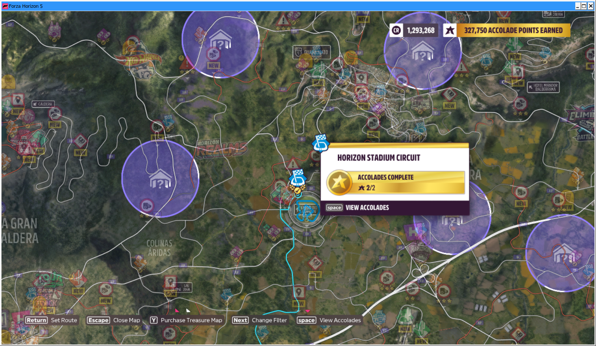
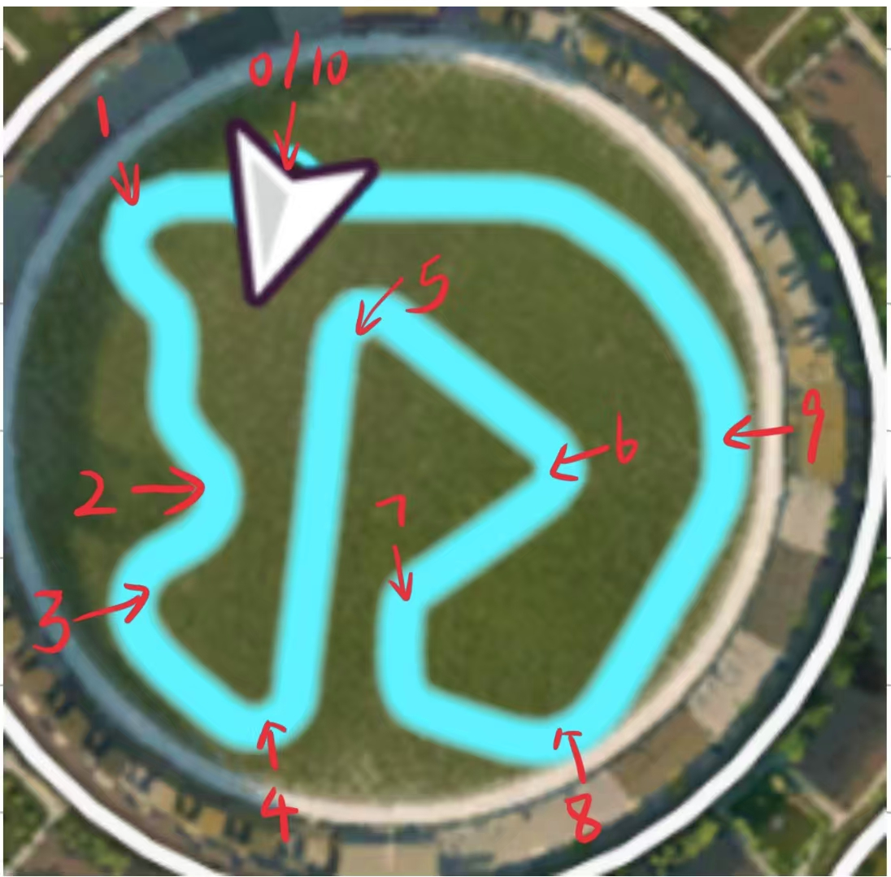

# Forza Horizon 5

## Prerequisites

- Purchase and install Forza Horizon 5 from Steam

## Setup Instructions

### 1. Configure Display Settings

- **Set screen resolution to 1280×720**
- **Enable windowed mode** (press `Alt + Enter` to toggle)

### 2. Configure Difficulty Settings

Navigate to: **Settings → Difficulty Settings**

- **Drivatar Difficulty**: NOVICE
- **Driving Assist Preset**: EASY

### 3. Select the Test Track

Drive to the **"Horizon Stadium Circuit"** - a closed track with clear boundaries.



### 4. Select Vehicle

To replicate our experiment settings, use:

- **Vehicle**: 1944 Ferrari F355 Berlinetta
- **Class**: A
- **PI**: 800

### 5. Start the Race

When you arrive at the track:

- Begin a **solo game**
- Run the agent script:

```bash
python scripts/play_game.py --config ./src/agent_client/configs/forza_horizon5/config.yaml
```

## Evaluation Criteria

### Scoring Method

- **Duration**: Run the game for **3 minutes** (approximately the time it takes a novice AI to complete 3 laps)
- **Count checkpoints**: Record the total number of checkpoints passed
- **Normalization**: Each lap has 10 checkpoints (including the finish line)
- **Final Score**: `checkpoints / 30` (normalized by total possible checkpoints in 3 laps)



## Notes

- Ensure the game is in windowed mode for proper agent interaction.
- The Horizon Stadium Circuit provides consistent racing conditions for evaluation.
- Checkpoint counting provides an objective measure of driving performance.
